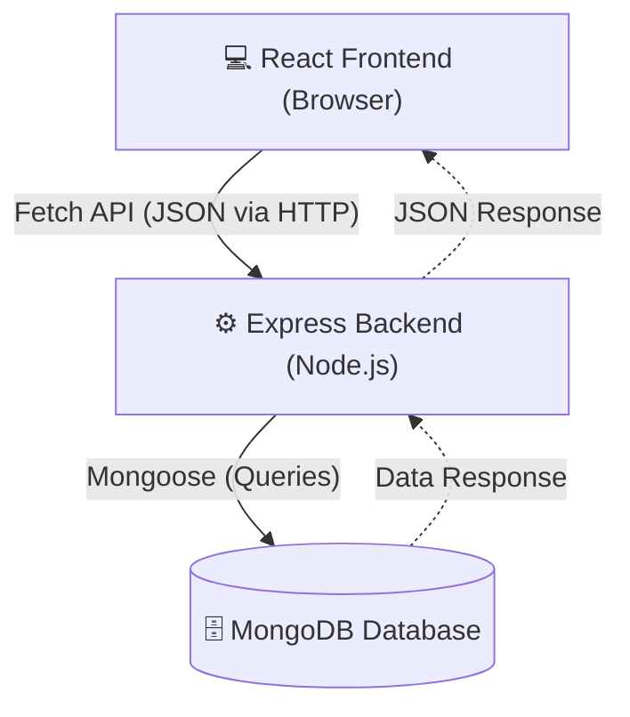
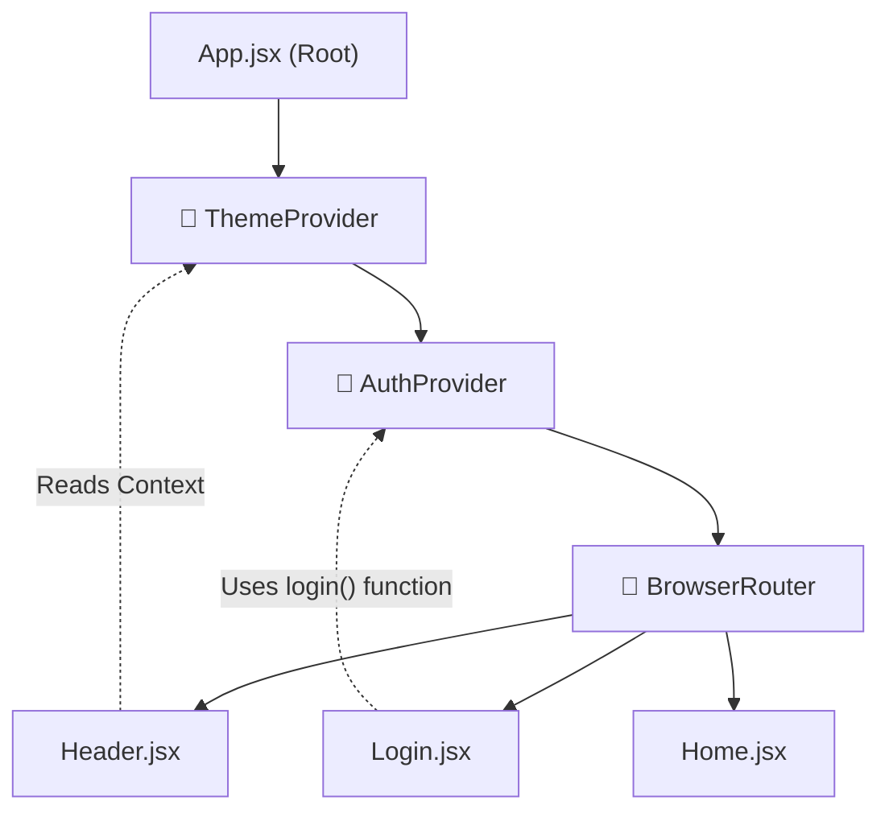
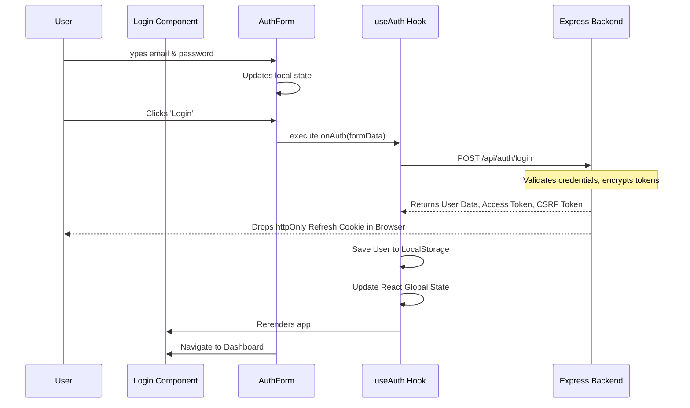
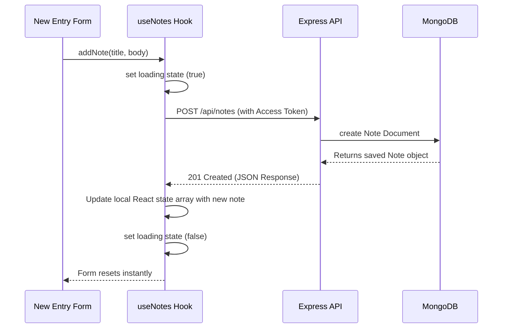

# 🌊 Journal App: Complete Architecture & Data Flow

This document serves as a permanent reference guide for how data moves, how state is managed, and how the MERN architecture is implemented in the Journal App.

---

## 1. The Global Architecture (The Big Picture)

Your application uses a modern decoupled architecture. The React frontend is completely separate from the Node.js backend. They only communicate by sending JSON data over HTTP requests.

### Key Concepts:
- **Stateless Backend:** The backend doesn't remember who is logged in between requests. It relies entirely on the frontend sending tokens with every request.
- **Single Page Application (SPA):** The frontend only loads once. React Router handles swapping out components (pages) instantly without making the browser reload.

---

## 2. Global State Management (Context API)

You have data that needs to be accessed *everywhere* in the app (like "Who is the logged-in user?" or "Is Dark Mode on?"). Passing this data down as props from component to component (Prop Drilling) would be a nightmare.

Instead, you use the **Context API**.

### Key Takeaway:
Because `AuthProvider` wraps the router, any component inside the app can use `useAuth()` to instantly pull data without worrying about parent/child relationships. The same logic applies to `ThemeContext`!

---

## 3. The Authentication Lifecycle

Authentication is the most complex flow in the app. It relies on short-lived Access Tokens (security) and long-lived Refresh Tokens (convenience).

### The Login Sequence

### Security Concepts Used:
- **`httpOnly` Cookie:** Used for the Refresh Token. It cannot be accessed by JavaScript (preventing Cross-Site Scripting or XSS attacks).
- **In-Memory Access Token:** Stored in a React `useRef` inside `AuthProvider`. By not storing it in `localStorage`, it is highly secure against script injection.
- **CSRF Token:** Protects your backend from Cross-Site Request Forgery attacks by verifying that the request came from your actual website.

---

## 4. The Journal Entry Flow (CRUD)

When a user creates a new journal entry, the data must be captured on the frontend, permanently saved to the database, and then quickly displayed back to the user.

### The "Optimistic UI" Principle
Notice how the `useNotes` hook handles the data. When the server responds with success, it grabs the newly returned note and injects it directly into the React state array:
`setNotes((prev) => [newNote, ...prev])`

Because it modifies the array in memory, React instantly updates the screen *without* making you refresh the page or perform a second `fetch` to get all the notes again!

---

## 5. Summary of Best Practices Learned

1. **Separation of Concerns:** `AuthForm` manages UI, `useAuth` manages global state, `api.js` manages network fetches. Each file does *one* thing well.
2. **Controlled Inputs:** React perfectly tracks every keystroke via `useState` or `react-hook-form` before ever sending it to the server.
3. **Smart/Dumb pattern:** Container components like `Login.jsx` just pass functions down to presentational components like `AuthForm.jsx`.
4. **Resilient API Handling:** Every network call gracefully catches errors and reliably toggles loading spinners using `finally` blocks.
