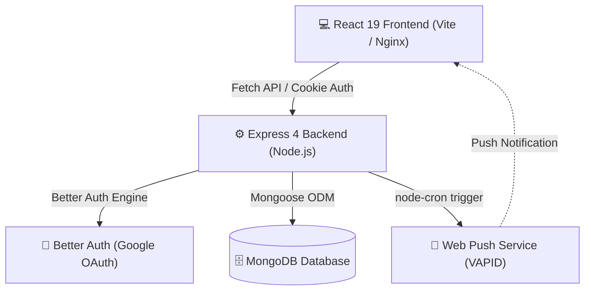

# 📓 JournalApp (Sanctuary)

A modern, full-stack, production-ready personal journaling platform built with the MERN stack, featuring Better Auth with Google OAuth, Web Push reminders, offline PWA resilience, interactive Swagger API documentation, and multi-container Docker deployment.

---

## ✨ Features

- 📝 **Rich Journaling (CRUD):** Create, update, search, filter, and organize thoughts and reflections.
- 🔐 **Modern Authentication:** Powered by **Better Auth** with Google OAuth 2.0 integration, secure HTTP-only cookies, and CSRF protection.
- ⏰ **Smart Reminders & Web Push:** Set daily journaling reminders backed by `node-cron` and browser Web Push notifications via VAPID keys.
- 🌓 **Dynamic Theme Engine:** Seamless dark and light mode toggle with smooth transitions.
- 📡 **Offline & PWA Ready:** Service worker caching with offline status detection and offline banners.
- 📖 **Interactive API Documentation:** Full OpenAPI/Swagger specification accessible via Swagger UI at `/api-docs`.
- 🐳 **Containerized Architecture:** Production-ready multi-stage Docker builds and `docker-compose` orchestration for MongoDB, API backend, and Nginx frontend.

---

## 🛠️ Tech Stack

| Layer | Technology | Details |
| :--- | :--- | :--- |
| **Frontend** | React 19, Vite 8 | React Router 7, React Hook Form, CSS Modules |
| **Backend** | Node.js, Express | ES Modules, MVC pattern, Express Validator |
| **Database** | MongoDB, Mongoose 8 | Document store with indexing and schema validation |
| **Authentication** | Better Auth | Google OAuth 2.0, Session management, HTTP-only cookies |
| **Scheduled Jobs** | node-cron, web-push | Background cron engine for scheduled push reminders |
| **API Docs** | Swagger UI, swagger-jsdoc | OpenAPI 3.0 specification at `/api-docs` |
| **DevOps & Deploy**| Docker, Docker Compose, Nginx | Multi-stage production builds and reverse proxy |

---

## 🏗️ System Architecture



---

## 📁 Repository Structure

```
JournalApp/
├── backend/
│   ├── config/            # Auth, Swagger, and server configuration
│   ├── controllers/       # Request handlers (notes, reminders, auth)
│   ├── db/                # MongoDB connection handler
│   ├── middleware/        # Error handlers, authentication guards
│   ├── models/            # Mongoose schemas (Note, Reminder, User)
│   ├── routes/            # REST API route endpoints
│   ├── services/          # Business logic and background cron tasks
│   ├── Dockerfile         # Node.js backend container definition
│   └── server.js          # Express server entry point
├── public/                # Static assets, web app manifest, icons
├── src/
│   ├── components/        # Reusable UI components & modals
│   ├── hooks/             # Custom React hooks (useAuth, useTheme)
│   ├── pages/             # Page views (Home, About, AuthCallback)
│   ├── services/          # API client and Better Auth client
│   └── App.jsx            # Main app shell and routing
├── docker-compose.yml     # Multi-container orchestration (Mongo, API, Web)
├── Dockerfile             # Multi-stage frontend Nginx build
└── nginx.conf             # Production reverse proxy configuration
```

---

## 🚀 Getting Started

### Prerequisites

- **Node.js**: v18.0.0+
- **MongoDB**: Local MongoDB instance or MongoDB Atlas URI
- **npm** or **yarn**
- *(Optional)* **Docker & Docker Compose**

---

### 1. Clone the Repository

```bash
git clone https://github.com/Srusti118/JournalApp.git
cd JournalApp
```

### 2. Configure Environment Variables

Create `.env` files for both the frontend and backend:

#### Frontend (`.env` in root directory)
```env
VITE_API_URL=http://localhost:5000/api/notes
```

#### Backend (`backend/.env`)
```env
PORT=5000
NODE_ENV=development
MONGODB_URI=mongodb://localhost:27017/journal
CLIENT_URL=http://localhost:5173

# Authentication & Security
JWT_SECRET=your_jwt_secret_here
JWT_REFRESH_SECRET=your_refresh_secret_here

# Google OAuth (Optional for local dev)
GOOGLE_CLIENT_ID=your_google_client_id
GOOGLE_CLIENT_SECRET=your_google_client_secret
GOOGLE_REDIRECT_URI=http://localhost:5000/api/auth/google/callback

# Web Push (VAPID)
VAPID_PUBLIC_KEY=your_vapid_public_key
VAPID_PRIVATE_KEY=your_vapid_private_key
VAPID_MAILTO=mailto:admin@sanctuary.app
```

---

### 3. Run Locally

#### Run Backend
```bash
cd backend
npm install
npm run dev
```
Backend API will start at: `http://localhost:5000`  
Interactive Swagger Docs: `http://localhost:5000/api-docs`

#### Run Frontend
Open a separate terminal in the root directory:
```bash
npm install
npm run dev
```
Frontend development server will start at: `http://localhost:5173`

---

## 🐳 Running with Docker Compose

To spin up the entire application (MongoDB, Backend API, and Frontend Nginx) in a single command:

```bash
docker-compose up --build
```

- **Frontend App:** `http://localhost:80`
- **Backend API:** `http://localhost:5000`
- **MongoDB:** `localhost:27017`

---

## 📡 API Reference

Interactive documentation and testing interface are available at `/api-docs`.

### Core Endpoints

| Method | Endpoint | Description |
| :--- | :--- | :--- |
| `GET` | `/health` | Healthcheck and timestamp |
| `GET` | `/api/notes` | Get all journal notes |
| `POST` | `/api/notes` | Create a new journal note |
| `PUT` | `/api/notes/:id` | Update an existing journal note |
| `DELETE` | `/api/notes/:id` | Delete a journal note |
| `GET` | `/api/reminders` | Fetch scheduled reminders |
| `POST` | `/api/reminders` | Create or update push notification reminder |
| `ALL` | `/api/auth/*` | Better Auth endpoints (login, register, OAuth) |

---

## 📜 Available Scripts

### Root (Frontend)
- `npm run dev`: Starts Vite local development server.
- `npm run build`: Compiles production assets into `dist/`.
- `npm run preview`: Locally previews production build.
- `npm run lint`: Runs ESLint analysis.

### Backend (`/backend`)
- `npm run dev`: Starts Express server with IPv4 priority.
- `npm run dev:watch`: Starts Express with `nodemon` auto-reload.
- `npm run start`: Starts production Node process.

---

## 📄 License

This project is licensed under the ISC License.
