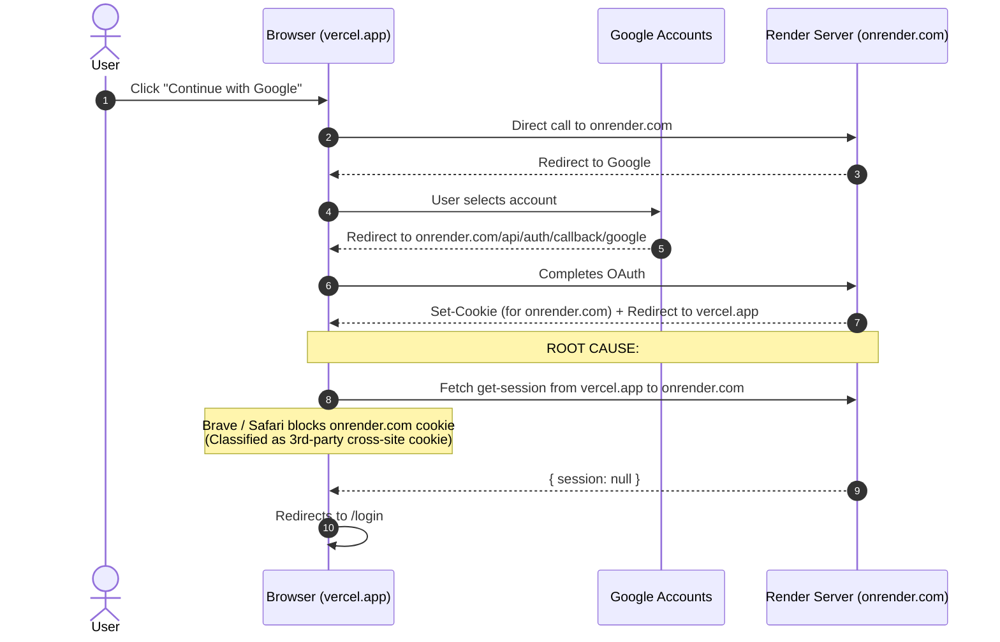
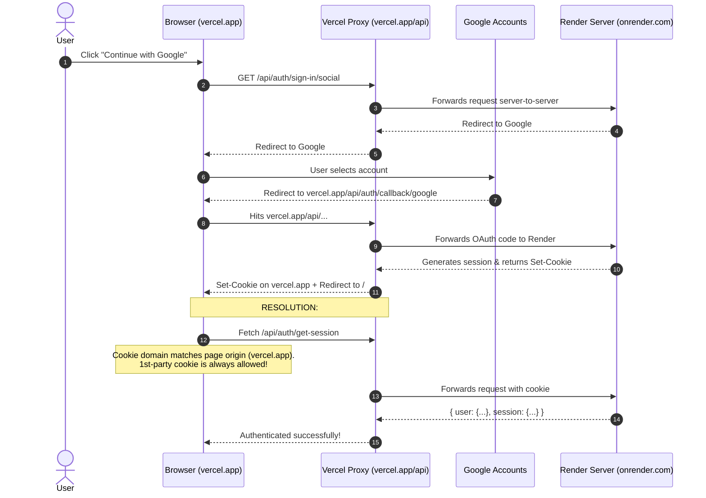

# Google OAuth Troubleshooting & Architecture Guide

This document records the root cause analysis, architecture design, and step-by-step resolution for the Google OAuth authentication issues encountered in production between the Vercel frontend and the Render backend.

---

## 1. Executive Summary & Symptoms

### Symptoms Encountered
1. **Redirect Loop back to `/login`**: After clicking "Continue with Google", selecting a Google account, and granting consent, the browser was redirected back to the `/login` screen instead of the dashboard.
2. **HTTP 405 Method Not Allowed / 404 Not Found**: Initial attempts to invoke OAuth endpoints resulted in HTTP routing errors.
3. **Brave Shields Dependency**: Authentication succeeded **only** when Brave Shields was disabled. When shields were active, the user remained logged out.

---

## 2. Root Cause Analysis

Three distinct technical obstacles contributed to the failure:

### A. Cross-Domain 3rd-Party Cookie Blocking (Primary Blocker)
* **Domain Setup**:
  * Frontend: `https://journal-app-five-iota.vercel.app`
  * Backend: `https://sanctuary-backend-8ntx.onrender.com`
* **Mechanism**:
  1. During the OAuth callback, Google redirected the user to `onrender.com`.
  2. Render set an authentication session cookie scoped to `onrender.com`.
  3. Render then redirected the user's browser back to `vercel.app`.
  4. When the React SPA on `vercel.app` initiated a background fetch (`/api/auth/get-session`) to `onrender.com`, modern browser security policies (Brave Shields, Safari Intelligent Tracking Prevention, Chrome Incognito) classified that cookie as a **third-party (cross-site) tracking cookie**.
  5. The browser silently stripped the cookie from the request header. Render received no session cookie, responded with `{ session: null, user: null }`, and the React app routed the user back to `/login`.

### B. Express 4.x vs Express 5.x Wildcard Splat Syntax
* Express 5.x introduces Path-to-RegExp v8 syntax where wildcards require parameter names (e.g., `app.all('/api/auth/*splat')`).
* The backend runs **Express 4.18.2**. In Express 4, `/*splat` is treated as a literal string pattern, causing requests to `/api/auth/sign-in/social` and `/api/auth/get-session` to return HTTP 404.
* Reverting the route to standard Express 4 wildcard `app.all('/api/auth/*', toNodeHandler(auth))` resolved route matching.

### C. React Auth Hook Lifecycle Race Condition
* In `src/hooks/useAuth.jsx`, the component initialized with `loading: false` before `better-auth`'s `useSession` completed its initial network handshake.
* On the first render tick, protected route wrappers in `App.jsx` detected `!user && !loading`, instantly triggering an imperative redirect to `/login` before the session response could arrive.

---

## 3. The Solution: First-Party Reverse Proxy Architecture

To guarantee cookies are never blocked by Brave Shields or Safari, the application architecture was shifted from cross-origin communication to a **Same-Origin Reverse Proxy**.

### Key Concept
The browser never communicates directly with `onrender.com`. Instead, all browser requests are sent to `journal-app-five-iota.vercel.app/api/*`. Vercel's edge network proxies these requests to Render server-to-server. Because the browser only communicates with `vercel.app`, the session cookie is saved and sent as a **1st-party cookie**, bypassing all cross-site tracker blocks.

---

## 4. Architectural Comparison

### Previous Flow (Direct Cross-Origin — Broken)



### Current Flow (Same-Origin Reverse Proxy — Fixed)



---

## 5. Implementation Details & File Changes

### 1. Vercel Reverse Proxy (`vercel.json`)
Configured a rewrite rule placing `/api/:path*` before the single-page application fallback:
```json
{
  "rewrites": [
    {
      "source": "/api/:path*",
      "destination": "https://sanctuary-backend-8ntx.onrender.com/api/:path*"
    },
    {
      "source": "/(.*)",
      "destination": "/index.html"
    }
  ]
}
```

### 2. Frontend Auth Client (`src/services/authClient.js`)
Configured dynamic baseURL resolution so production browsers automatically target `window.location.origin`:
```javascript
const getBaseUrl = () => {
  const envUrl = import.meta.env.VITE_API_URL
  if (envUrl && /^https?:\/\//i.test(envUrl)) {
    return envUrl.replace(/\/api\/?$/, '')
  }
  if (typeof window !== 'undefined') {
    return window.location.origin
  }
  return 'http://localhost:5000'
}
```

### 3. Frontend API Base URL (`src/constants/api.js`)
Configured standard API routes to default to relative `/api` in production:
```javascript
export const API_BASE_URL =
  import.meta.env.VITE_API_URL ||
  (typeof window !== 'undefined' && window.location.hostname !== 'localhost' ? '/api' : 'http://localhost:5000/api')
```

### 4. Backend Authentication Config (`backend/config/auth.js`)
* Switched OAuth state storage to database (`storeStateStrategy: 'database'`) to prevent OAuth state parameter cookies from being lost across redirects.
* Enabled `useSecureCookies: process.env.NODE_ENV === 'production'`.
* Enabled `trustedProxyHeaders: true` so Better Auth accurately identifies protocol and host through Vercel's proxy headers.

### 5. Backend Express Handler (`backend/app.js`)
Maintained Express 4 wildcard pattern compatibility:
```javascript
app.all('/api/auth/*', toNodeHandler(auth))
```

### 6. Auth Hook State Guard (`src/hooks/useAuth.jsx`)
Ensured `loading` remains `true` until Better Auth's `useSession` completes its initial request:
```javascript
const [loading, setLoading] = useState(true)

useEffect(() => {
  if (!isPending) {
    setLoading(false)
  }
}, [isPending])
```

---

## 6. Production Configuration Checklist

| Service | Setting / Variable | Expected Value |
|---|---|---|
| **Google Cloud Console** | Authorized Redirect URIs | `https://journal-app-five-iota.vercel.app/api/auth/callback/google`<br/>`http://localhost:5000/api/auth/callback/google` |
| **Google Cloud Console** | Authorized JavaScript Origins | `https://journal-app-five-iota.vercel.app`<br/>`http://localhost:5173` |
| **Render Dashboard** | `BETTER_AUTH_URL` | `https://journal-app-five-iota.vercel.app` |
| **Render Dashboard** | `FRONTEND_URL` | `https://journal-app-five-iota.vercel.app` |
| **Render Dashboard** | `CLIENT_URL` | `https://journal-app-five-iota.vercel.app` |
| **Vercel Dashboard** | `VITE_API_URL` | `/api` *(or left unset, as code defaults to `/api`)* |
